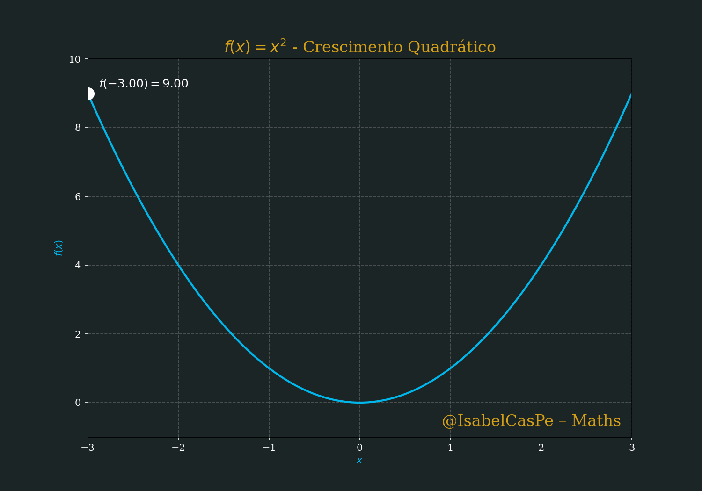
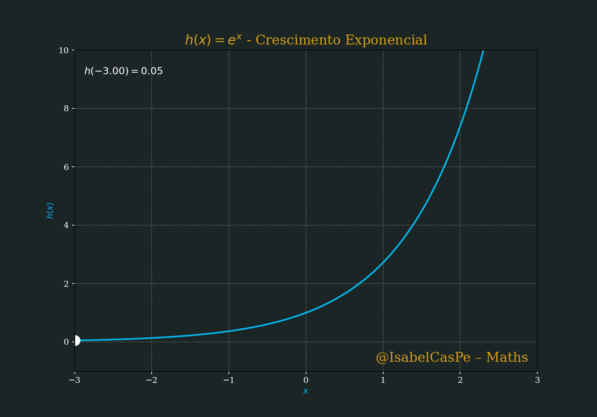
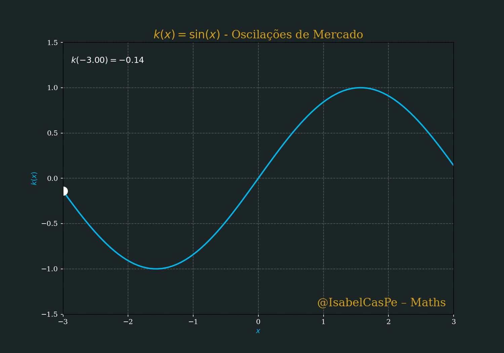
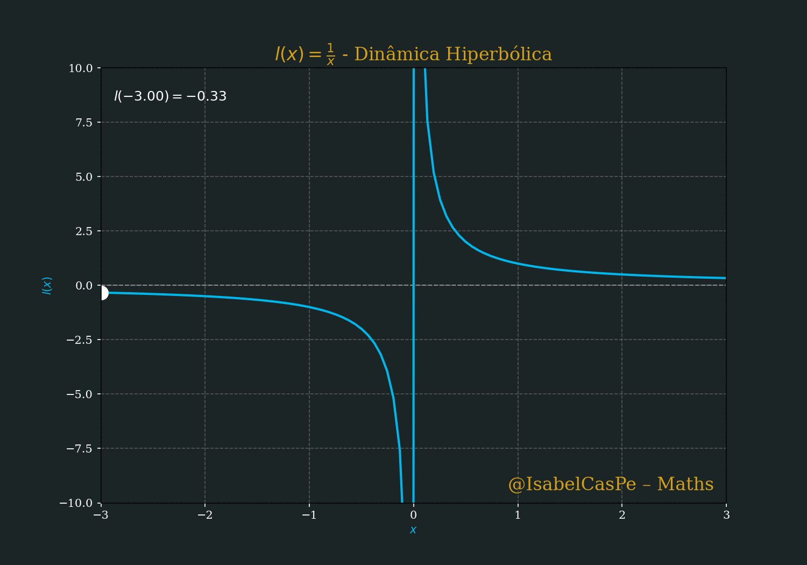
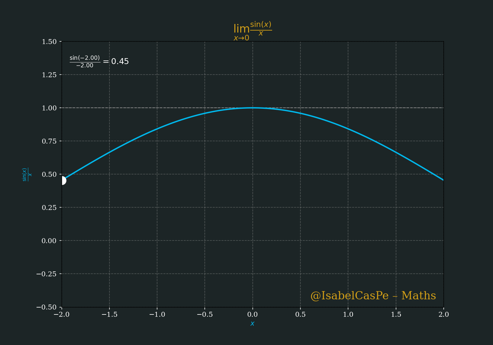
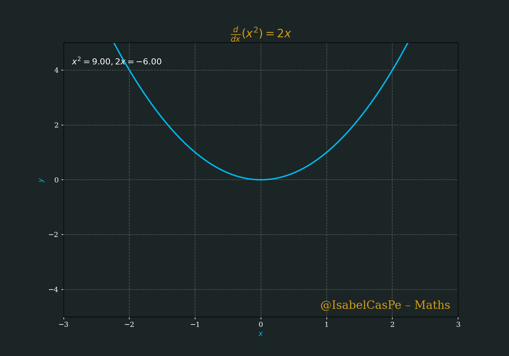
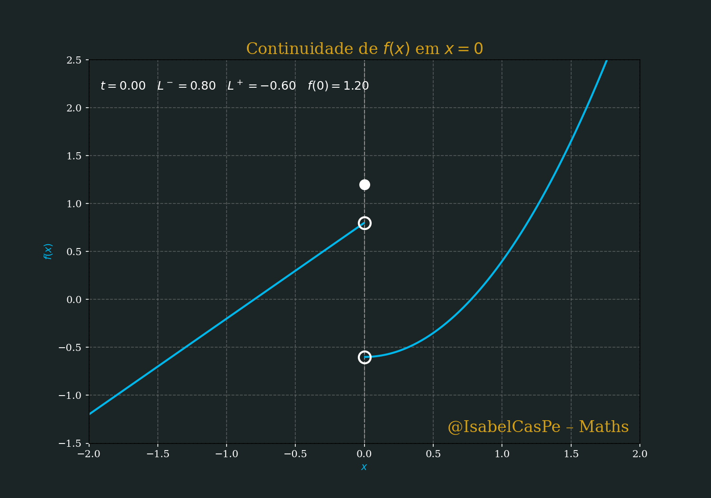
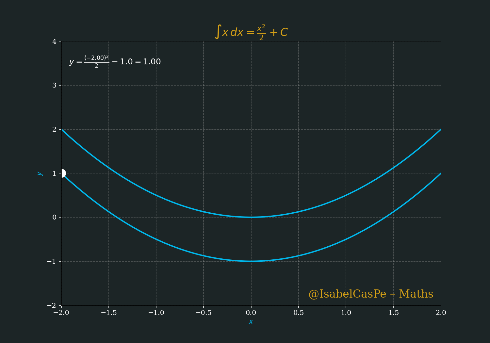
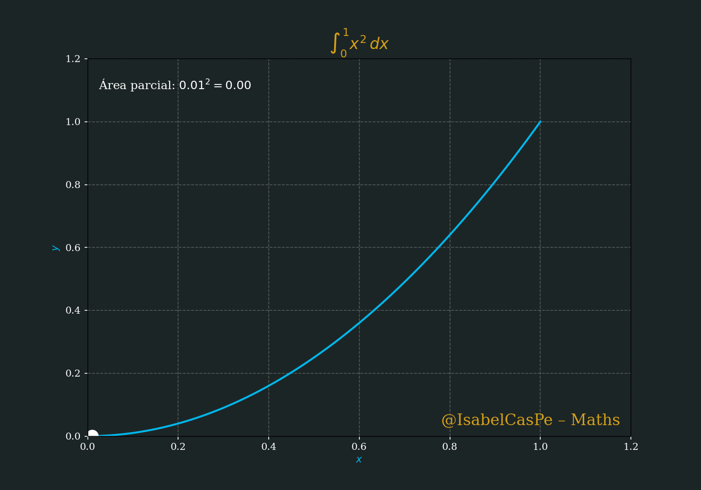

<!-- HERO -->
# Arte & Ciência em Movimento — Matemática Viva 💎🧮✨


**PT · EN · ES** · [Galeria](#galeria--gifs) · [Instalação](#instalação--installation--instalación) · [Licença MIT](#licença--license--licencia)

---
## Repositório CALCULUS
# 📊 Calculus I-III: A Magia Matemática das Finanças : Criado por Ana Isabel Castillo, este repositório oferece uma abordagem moderna, visual e aplicada ao Cálculo, com foco especial em aplicações financeiras.

Bem-vindo ao repositório **Calculus I-III**, um curso trilíngue (Português, Inglês, Espanhol) que transforma o poder do Cálculo em ferramentas práticas para o mundo financeiro. Com um estilo único, combinamos matemática pura, códigos Python e aplicações financeiras para modelar mercados complexos, otimizar portfólios e prever riscos. Criado com paixão por *Ana Isabel Castillo* e inspirado no charme do meu Belo gatinho Loki, este repositório é o mapa estelar para dominar o cosmos financeiro! 
## Licença
- Códigos Python: [MIT License](LICENSE)


## 📚 Sobre o Curso

## 🌟 Destaques

- **Cálculo I**: Fundamentos que constroem a base do sucesso financeiro (limites, derivadas, continuidade).
- **Cálculo II**: Integrais e séries numéricas para calcular lucros e construir fortunas.
- **Cálculo III**: Multivariáveis, teoremas fundamentais, otimização e integrais de linha para modelar mercados em 3D.
- **Aplicações em Finanças**: De preços de opções a portfólios otimizados, usamos Cálculo para liderar o caos do mercado.

## 📂 Estrutura do Repositório
---
## Visualizações Matemáticas

### 📈 Crescimento Quadrático
*Curvatura positiva e aceleração do crescimento.*


### 📈 Crescimento Exponencial


### 🔄 Oscilação Senoidal
*Dinâmica periódica: amplitude, frequência e fase.*


### 🌀 Dinâmica Hiperbólica


## Visualizações Adicionais

### ♾️ Limite
*Conceito de aproximação e tendência.*


### 📉 Derivada


### 🔗 Continuidade (em x=0)
*De descontínua → contínua: os limites laterais \(L^-\) e \(L^+\) e o valor \(f(0)\) convergem até coincidirem.*


### ∫ Integral Indefinida


### ∫ Integral Definida


### 🏔️ Superfície de Sela (Dinâmica)
*Geometria hiperbólica com deformação temporal e rotação.*


---

## 📘 Calculus I – Fundamentos

- [Introdução ao Cálculo I](./intro.pdf)
- [Continuidade](./continuidade.pdf)
- [Regras de Derivação](./regrasDderivaçao.pdf)
- [Máximos e Mínimos](./maxemin.pdf)

---

## 📗 Calculus II – Integrais e Séries

- [Introdução às Finanças - Cálculo II](./intro2.pdf)
- [Integrais Definidas](./IntegraisDefinidas.pdf)
- [Integração por Partes](./inteporPartes.pdf)
- [Integração por Substituição](./inteporsubs.pdf)
- [Séries Numéricas: Construindo Fortunas](./seriesnumericas.pdf)

---

## 📙 Calculus III – Multivariáveis e Modelagem Financeira

- [Introdução ao Cálculo III](./intro3.pdf)
- [Teoremas Fundamentais (Green, Stokes, Divergência)](./TeoremasC3.pdf)
- [Otimização Multivariável](./otimizacaomultiv.pdf)
- [Integrais de Linha](./IntegraisDlinha.pdf)
- [Aplicações Práticas](./aplicacoespraticas.pdf)
- Materiais Educativos (LaTeX): [Creative Commons Attribution 1.0](https://creativecommons.org/licenses/by/1.0/)
- [Solução da Equation Black-Scholes com o Loki](./equationBlackScholes.pdf)

##📊 [Calculus Banner](Calculus-III/figures/fig16c3.png)
---
##  Como Usar
### 📖 Materiais Educativos (LaTeX)

- **Códigos Python**: `/Calculus-III/codes/` contém scripts para gerar gráficos ([fig1c3.png](Calculus-III/figures/fig1c3.png) a [fig16c3.png](Calculus-III/figures/fig16c3.png)).
- **Figuras**: `/Calculus-III/figures/` armazena gráficos gerados com NumPy e Matplotlib.
## 📚 Referências Bibliográficas

- Stewart, J. (2015). *Cálculo: Volume 1-2*. Cengage Learning.
- Föllmer, H. & Schied, A. (2016). *Stochastic Finance: An Introduction in Discrete Time*. Walter de Gruyter.
- Simon, C. P., & Blume, L. (1994). *Mathematics for Economists*. W. W. Norton & Company.

## Licença
- Códigos Python: [MIT License](LICENSE)
- Materiais Educativos (LaTeX): [Creative Commons Attribution 1.0](https://creativecommons.org/licenses/by/1.0/)
 ## Créditos
Criado com paixão por Ana Isabel Castillo.    
---
## Inspiration.

> "Das curvas do limite ao infinito das integrais, o Cálculo desvendando o ritmo do cosmos @Cálculo  onde cada derivada revela sua genialidade." ♾️ 📈 ∫ ∑

>  *"Cálculo III é o alquimista supremo, forjando fortunas no cadinho do mercado!"*

>  Copyright © 2025 Prof. Ana Isabel C. 💙
---
```bash
git clone https://github.com/IsabelCasPe/Calculus-I-III.git
Rode `.py` com Python (NumPy, Matplotlib).


